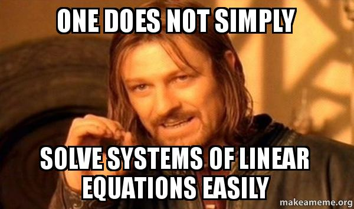

# Approximations

Implementations/Benchmarking/Discussions about some math stuff.





## FAQ

1. Why there are two tolerances (```rtol``` and ```atol```) for checking if two values are "nearly identical"?

    * ```rtol``` stands for ```relative tolerance``` controls the number of correct digits in the new guesses solution
    * ```atol``` stands for ```absolute tolerance``` is a safety measure for comparisons near the ```0(zero)``` value.

    The formula that is used in the [numpy library](https://numpy.org/doc/stable/reference/generated/numpy.allclose.html) (also in [torch](https://pytorch.org/docs/stable/generated/torch.allclose.html)) is:
    ```
    |best_guess - maybe_best_guess| < rtol * |best_guess| + atol
    ```

    If ```maybe_best_guess``` is ```0 (zero)``` we need to have a non-zero value for ```atol``` to make sure the algorithm finishes.

    The formula used in the [math library](https://docs.python.org/dev/library/math.html#math.isclose) is:
    ```
    |best_guess - maybe_best_guess| < max(atol, rtol * max(|best_guess|, |maybe_best_guess|))
    ```
    If ```maybe_best_guess``` or ```best_guess``` are both near zero, we go back to the same scenario.
    

    ### Reference
    * All this info and much more can be found [here](http://web.mit.edu/10.001/Web/Tips/Converge.htm).